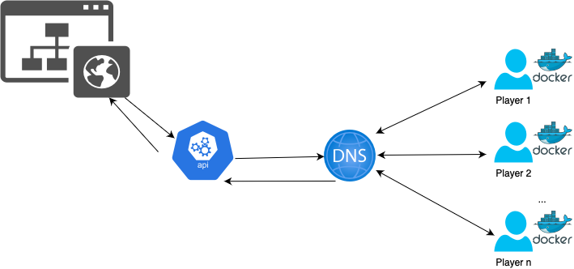

# cognitive-equinox-22
## Calamar NaaS 

Team Cognitive equinox 2022 repo of Naas example.
Develop the moderator's vision of the squid game.

Allowing the following actions:
  - Add new players to the network
- Remove players from the network
- Check which players are still alive
- Allow communication between living players

All this through an API and a website

## Architecture

## Technologies
 - Bind9 as DNS
 - Flask
 - Python
 - Docker